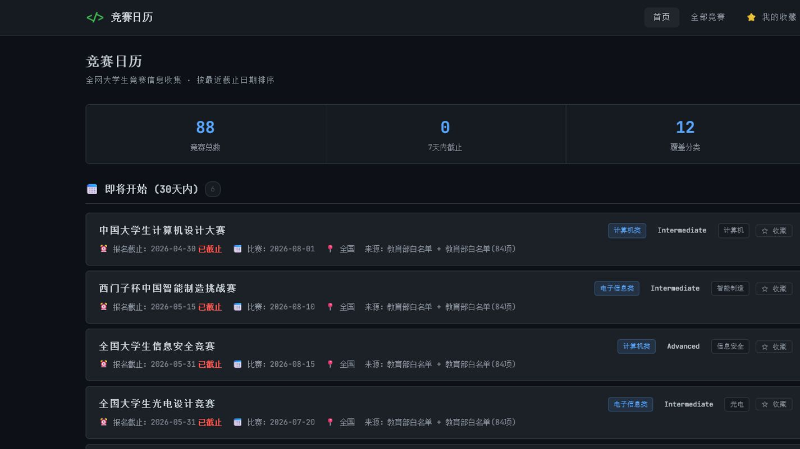
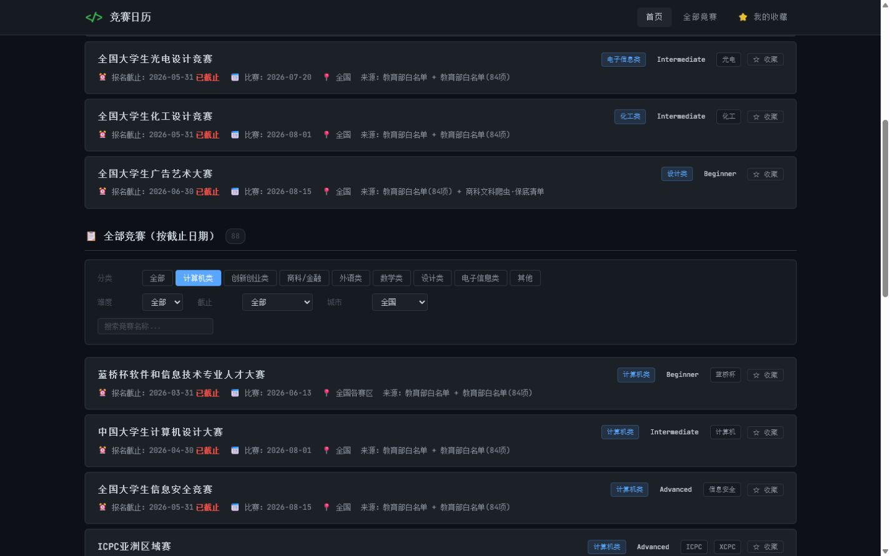
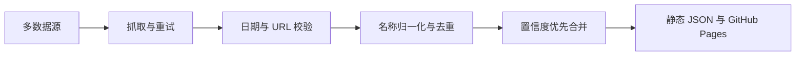

[English](README_EN.md)

# 竞赛日历

面向大学生的竞赛信息日历：聚合多数据源，按报名截止时间浏览、搜索和筛选竞赛，并提供官方链接供进一步核实。

[在线 Demo](https://tobyberry666.github.io/competition-calendar/) · [GitHub Actions](https://github.com/tobyberry666/competition-calendar/actions)



## 要解决的问题

竞赛信息分散在官网、聚合站和活动平台，名称、日期和链接也可能不一致。竞赛日历将这些信息集中为可筛选的静态日历，帮助用户先发现候选赛事，再前往官方页面确认。

## 已验证的功能

- 按报名截止日期排序，并支持关键词搜索和分类筛选。
- 展示赛事时间线、来源、置信度及官网链接；可在浏览器本地收藏。
- 2026-07-20 在已部署页面观察到 88 场竞赛；这是当日观察结果，数据会随每日更新变化。



## 数据处理流程



重复记录合并时，系统优先选择置信度更高、已验证、有日期、且带官方 URL 的记录。随后以非空字段补全官网链接、主办方、分类、时间线和更完整的描述，因此不会因选择主记录而丢弃另一来源的有用信息。

## 本地运行

```bash
pip install -r requirements.txt
python main.py
cd frontend
python -m http.server 8000
```

在浏览器打开 `http://localhost:8000`。Windows 也可运行 `启动预览.bat` 进行本地预览。

## 测试与每日自动化

```bash
python -m unittest discover -s tests -v
python -m compileall main.py crawlers tests
```

GitHub Actions 每天北京时间 07:00 运行采集与单元测试，生成静态 JSON，并将 `frontend/` 部署到 GitHub Pages。工作流也支持手动触发。

## 数据来源与准确性说明

数据来自教育部白名单种子、竞赛聚合站、赛事平台及专项来源。年份和日期格式校验仅用于教育部白名单记录的官网直采补充；URL 校验只检查链接可访问性，不能证明链接归属或权威性。数据仅供参考，报名资格、时间、规则和链接均应以竞赛官方网站的最新发布为准。

## 添加数据源

1. 在 `crawlers/` 新建抓取模块，返回竞赛记录列表。
2. 从 `crawlers.seed_data` 导入 `make_id`，并为每条记录使用 `id: make_id(name)` 生成稳定 ID；该 ID 用于详情路由和浏览器本地收藏。
3. 提供名称、来源、分类、时间线和 `officialUrl` 等可获得字段。
4. 在 `main.py` 中导入并接入该抓取函数；必要时在 `crawlers/categories.py` 增加分类关键词。
5. 运行测试与爬取流程，检查生成的 `frontend/data.json`。

## 许可证

本项目采用 [MIT License](LICENSE)。
