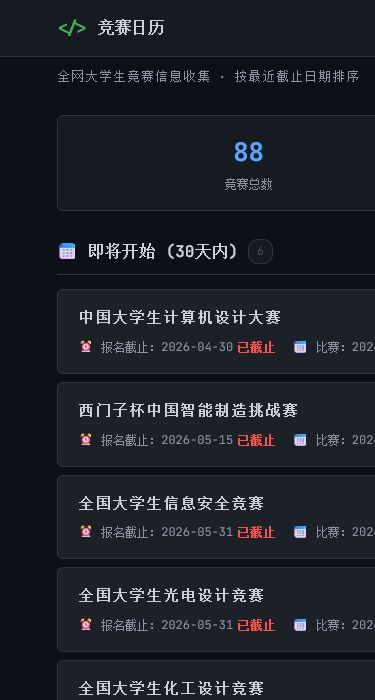
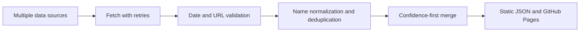

[中文](README.md)

# Competition Calendar

A competition calendar for university students. It brings together multiple data sources so competitions can be browsed, searched, and filtered by registration deadline, with official links for follow-up verification.

[Live Demo](https://tobyberry666.github.io/competition-calendar/) · [GitHub Actions](https://github.com/tobyberry666/competition-calendar/actions)


## The problem

Competition notices are spread across official sites, aggregators, and event platforms. Names, dates, and links may differ between sources. Competition Calendar turns those inputs into a filterable static calendar: use it to discover candidate events, then confirm the details on the official site.

## Verified features

- Deadline-ordered listings, keyword search, and category filters.
- Competition timelines, sources, confidence labels, and official links, plus browser-local favorites.
- Responsive desktop and mobile layouts. The deployed site was observed to show 88 competitions on 2026-07-20; this is a dated observation, not a permanent total, because daily updates can change the data.




## Data pipeline



When duplicate records are merged, the preferred record is selected by higher confidence, verification status, available dates, and an official URL. Non-empty fields are then overlaid to retain useful official links, organizers, categories, timeline values, and fuller descriptions from the other record.

## Run locally

```bash
pip install -r requirements.txt
python main.py
cd frontend
python -m http.server 8000
```

Open `http://localhost:8000` in a browser. On Windows, `启动预览.bat` also starts a local preview.

## Tests and daily automation

```bash
python -m unittest discover -s tests -v
python -m compileall main.py crawlers tests
```

GitHub Actions runs collection and unit tests every day at 07:00 China Standard Time, generates static JSON, and deploys `frontend/` to GitHub Pages. The workflow can also be started manually.

## Data sources and accuracy

Inputs include the Ministry of Education whitelist seed data, competition aggregators, event platforms, and specialist sources. Dates and URLs are validated, but the data is reference-only: eligibility, schedules, rules, and links are governed by the latest information on the official competition site.

## Add a data source

1. Create a crawler module in `crawlers/` that returns a list of competition records.
2. Include the fields that are available, such as name, source, category, timeline, and `officialUrl`.
3. Import and schedule the crawler in `main.py`; add category keywords in `crawlers/categories.py` when needed.
4. Run the tests and collection flow, then inspect the generated `frontend/data.json`.

## License

Released under the [MIT License](LICENSE).
